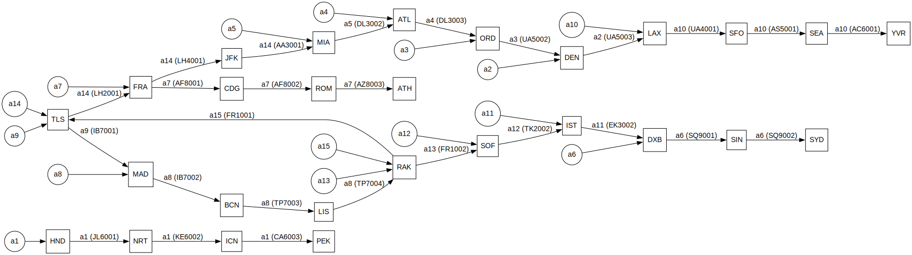
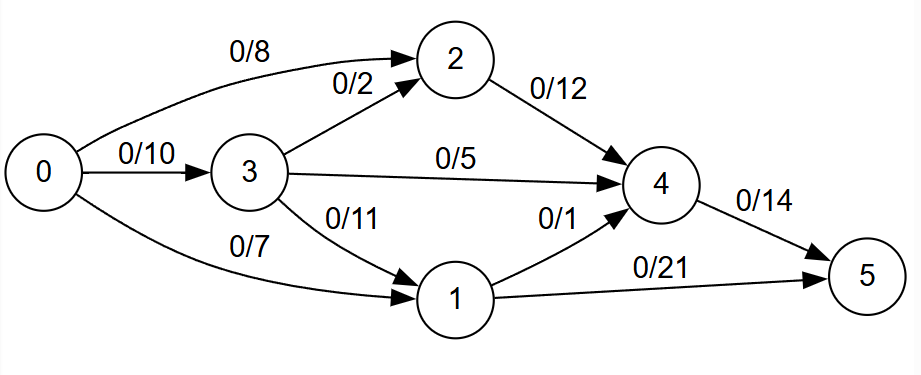
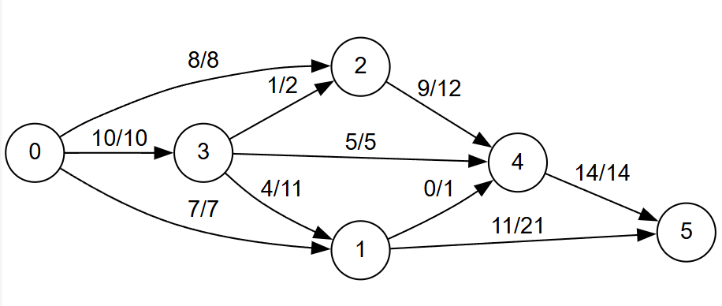

# Maxflow Problem & Airline Scheduling

This project implements:

- A maximum flow solver using the **Ford–Fulkerson algorithm**.
- An **airline scheduling solver** using a variation of a bounded circulation graph (flow with lower bounds).

It can be used to:
- Solve generic max-flow problems from graph files.
- Compute feasible airline schedules using at most `k` airplanes or crew members.




<center>

*Example scheduling of 15 airplanes across 26 flights*

</center>

## Dependencies

- OCaml ≥ 4.13
- dune
- graphviz (optional, for SVG export)

## Run

Build the project
```
dune build / make build
```

The executable supports two modes:

- `flow`
- `scheduling`

### Flow problem

```bash
./maxflow flow infile source sink outfile [svgfile]
```
Graph files are located in the `graphs/` folder.

#### Example

```bash
./maxflow flow graphs/graph3.txt 0 5 result
```
With SVG export:
```bash
./maxflow flow graphs/graph3.txt 0 5 result result_svg
```
This generates:
- `result.dot`
- optionally `result_svg.svg`


### Airline scheduling

Example schedules are located in the `scheduling/` folder.

```bash
./maxflow scheduling infile airplane_count outfile [svgfile]
```

#### Example

```bash
./maxflow scheduling scheduling/schedule1.txt 10 output
```

This generates:
- `output.schedule`  (text schedule)
- `output.dot`       (graph visualization)
- optionally `output.svg`


## How the project works

### Maximum flow

The project implements the **Ford–Fulkerson algorithm**, which calculates the maximum flow in an oriented graph.
Consider the following example:

<p align="center">



</p>

Each edge has an initial flow value (mostly 0) and a maximum flow capacity, the **Ford–Fulkerson algorithm** computes the maximum flow that can be passed between two nodes (namely source and sink), in our case if we choose 0 as the source, and 5 as the sink:

<p align="center">



</p>

The maximum flow we can pass is 25. 
The algorithm works by converting the flow graph into a residual flow graph, and finding augmenting paths exhaustively. The graph is valid as long as, for each node, the sum of incoming flow is equal to the sum of outgoing flow:

<p align="center">

<picture>
  <source media="(prefers-color-scheme: dark)" srcset="./img/formulas/sum_of_flow_dark.png">
  <source media="(prefers-color-scheme: light)" srcset="./img/formulas/sum_of_flow_light.png">
  
</picture>

</p>

Except for the sink and the source (net outflow, net inflow)

If you want to know more about how the **Ford–Fulkerson algorithm** works, [this website](https://algorithms.discrete.ma.tum.de/graph-algorithms/flow-ford-fulkerson/index_en.html) helped me a lot understand it.

## Airline scheduling model

Given a limited amount of airplanes (or crews), we want to assign a list of flights to each airplane following these criteria:

- Each flight requires one airplane (duh).
- Each flight is performed exactly once.
- A plane can only continue to another flight if it arrives early enough and at the same airport.

This is modeled as a **bounded circulation problem** (flow with lower bounds).

### Bounded circulation model

A bounded ciculation model is the generalization of network flow problems, with the added constraint of a lower bounds on edge flows, i.e instead of a simple flow graph with only capacity, each edge `e` has: 

- lower bound `l(e)`
- capacity `u(e)`
- flow `f(e)` such that:

<p align="center">

<picture>
  <source media="(prefers-color-scheme: dark)" srcset="./img/formulas/flow_condition_dark.png">
  <source media="(prefers-color-scheme: light)" srcset="./img/formulas/flow_condition_light.png">
  
</picture>

</p>

Each vertex `v` is also defined with a demand, that represents how much flow that node requires, the formula for the demand of a vertex is defined as the difference between incoming and outgoing lower bounds:

<p align="center">

<picture>
  <source media="(prefers-color-scheme: dark)" srcset="./img/formulas/demand_condition_dark.png">
  <source media="(prefers-color-scheme: light)" srcset="./img/formulas/demand_condition_light.png">
  
</picture>

</p>

(this is widely used in problems like the Circulation-Demand problem, where some factories produce goods and some villages that each have a demand rate)

### Use with Ford-Fulkerson

The Ford-Fulkerson cannot be applied directly to a bounded circulation graph, as it cannot handle lower bounds, as such, the circulation graph will need to be converted to an equivalent maxflow problem, to do so, lower bounds need to be eliminated, and that is done by subtracting the lower bound of each edge from its flow, and updating the demands accordingly.

After updating the flows and demands, two additional nodes need to be added, a super source `(SS)` and a super sink `(TT)`, their relationship with the rest of the vertices is defined like so:

<p align="center">

<picture>
  <source media="(prefers-color-scheme: dark)" srcset="./img/formulas/for_each_vertex_dark.png">
  <source media="(prefers-color-scheme: light)" srcset="./img/formulas/for_each_vertex_light.png">
  
</picture>

</p>

Computing the Ford-Fulkerson algorithm such that all net outflow coming from SS is equal to the sum of the positive demands of the graph:

<center>

<p align="center">

<picture>
  <source media="(prefers-color-scheme: dark)" srcset="./img/formulas/sum_of_SS_dark.png">
  <source media="(prefers-color-scheme: light)" srcset="./img/formulas/sum_of_SS_light.png">
  
</picture>

</p>

</center>

results in all the demands being satisfied, and in the case of the equivalent Circulation problem, all demands and lower bounds are satisfied.

### Modelisation of the Airline Scheduling Problem

Given an airplane count `C`, the Airline Scheduling Problem circulation graph is defined like so:

<center>

<p align="center">

<picture>
  <source media="(prefers-color-scheme: dark)" srcset="./img/formulas/airline_scheduling_dark_mode.png">
  <source media="(prefers-color-scheme: light)" srcset="./img/formulas/airline_scheduling_light_mode.png">
  
</picture>

</p>

</center>

Two flights are compatible if the second is spaced out enough that it can be joined by the same airplane after the first has landed, in this project, I have made the arbitrary choice to make that condition be:
- Flight 1's destination airport is the same as Flight 2
- Flight 1's arrival time is at least 30 minutes before Flight 2
That being said, this condition can be further developer to allow airplanes to join neighboring airports for example.

As explained above, after converting this circulation graph to its maxflow equivalent and adding the super source and super sink, if computing the maximum flow satisfies the condition `sum of outgoing flow from SS = total demand`, the demands of the circulation graph are satisfied.

Therefore, [it is claimed and proved](https://en.wikipedia.org/wiki/Maximum_flow_problem#cite_note-ITA-43) that finding a flow value of `C` between `s` and `t` is equal to finding a feasible schedule for the given flight set with at most `C` airplanes.

#### Finding the minimum needed airplanes

Since the outgoing flow of `s` is the number of airplanes, one might conclude that it is enough to run the algorithm with a high enough `C` value. However, since the algorithm is greedy, or rather generous, it will instead use airplanes at its disposition before connecting the same airplane between two flights.
As an example, you can try running the algorithm on the provided `schedule3.txt` (in the `scheduling` folder), which has a lot of connectable flights, with a value like `20`, then run it again with a value `10`, you will notice that the algorithm now schedules one airplane for multiple flights, which it did not choose to do beforehand.

## Resources

These are the resources I have researched and used for the purpose understanding this project

- https://en.wikipedia.org/wiki/Maximum_flow_problem
- https://www.youtube.com/watch?v=HyFsVuae9-w
- https://ocw.tudelft.nl/wp-content/uploads/Algoritmiek_Extensions_to_Max_Flow_-_circulations_01.pdf

